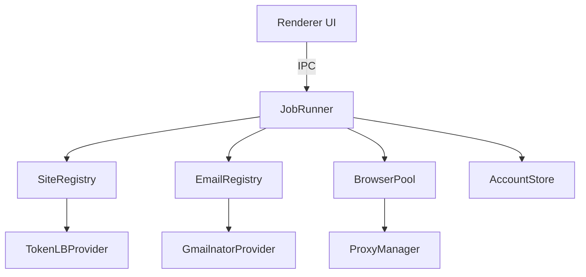

# 01 — Overview

## Mục tiêu

Xây dựng desktop app (Electron) tự động đăng ký tài khoản trên các website, bắt đầu với [tokenlb.net/sign-up](https://tokenlb.net/sign-up).

### MVP (phase 1)

- Đăng ký 1 hoặc nhiều tài khoản tokenlb.net
- Email tạm qua [Gmailnator RapidAPI](https://rapidapi.com/johndevz/api/gmailnator)
- Giải Cloudflare Turnstile qua cloak browser (hidden `BrowserWindow`)
- Lưu `username`, `password`, `email`, `registeredAt` ra JSON, export được
- Nhập Gmailnator API key trong Settings

### Mở rộng (thiết kế sẵn, implement sau)

- Thêm site provider mới (chỉ cần file plugin + đăng ký registry)
- Thêm email provider mới (temp-mail khác, IMAP, v.v.)
- Nhiều browser profile chạy song song hoặc pool
- Proxy HTTP / SOCKS5 gán theo browser hoặc theo job
- UI chọn site + cấu hình riêng từng site

## Tech stack

| Thành phần | Lựa chọn |
|------------|----------|
| Runtime | Electron 33+ |
| Bundler | `electron-vite` (main + preload + renderer) |
| Language | TypeScript |
| UI | React, CSS thuần |
| HTTP (main) | `fetch` + `socks-proxy-agent` / `undici` ProxyAgent cho SOCKS5 |
| Proxy (browser) | `session.setProxy()` per browser partition |
| Storage | `electron-store` (settings) + `accounts.json` (kết quả) |
| Plugin discovery | Registry pattern, import tĩnh hoặc folder `plugins/` |

## Cấu trúc thư mục tổng quan

```
d:\Code\tokenlb\
├── docs/plan/                  # Plan docs (file này)
├── package.json
├── electron.vite.config.ts
├── src/
│   ├── shared/                 # Types + interfaces dùng chung 3 process
│   │   ├── types/
│   │   └── contracts/          # SiteProvider, EmailProvider, ...
│   ├── main/
│   │   ├── index.ts
│   │   ├── core/
│   │   │   ├── registry.ts       # Plugin registry
│   │   │   ├── job-runner.ts     # Orchestrator
│   │   │   └── context.ts        # JobContext (browser, proxy, providers)
│   │   ├── browser/
│   │   │   ├── browser-pool.ts
│   │   │   ├── browser-profile.ts
│   │   │   └── cloak-session.ts
│   │   ├── proxy/
│   │   │   ├── proxy-manager.ts
│   │   │   └── proxy-parser.ts
│   │   ├── email-providers/
│   │   │   └── gmailnator/
│   │   ├── site-providers/
│   │   │   └── tokenlb/
│   │   ├── storage/
│   │   │   └── account-store.ts
│   │   └── ipc/
│   ├── preload/
│   └── renderer/
```

## Luồng tổng quan



Chi tiết kiến trúc: [02-architecture.md](./02-architecture.md)
