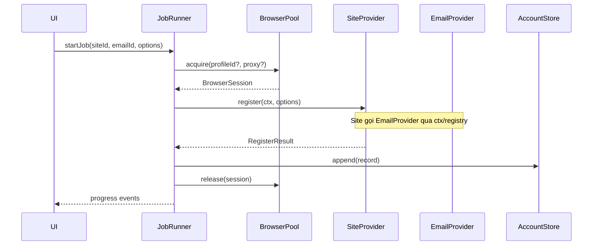

# 02 — Architecture (Plugin-Based)

## Tầng kiến trúc

```
┌─────────────────────────────────────────────┐
│  Renderer (React UI)                        │
├─────────────────────────────────────────────┤
│  Preload (contextBridge IPC)                │
├─────────────────────────────────────────────┤
│  Main Process                               │
│  ┌─────────┐ ┌──────────┐ ┌──────────────┐  │
│  │ JobRunner│ │ Registry │ │ BrowserPool  │  │
│  └────┬────┘ └────┬─────┘ └──────┬───────┘  │
│       │           │               │          │
│  ┌────▼────┐ ┌────▼─────┐ ┌──────▼───────┐  │
│  │ Site    │ │ Email    │ │ ProxyManager │  │
│  │Provider │ │ Provider │ │              │  │
│  └─────────┘ └──────────┘ └──────────────┘  │
└─────────────────────────────────────────────┘
```

## Core contracts (`src/shared/contracts/`)

### `SiteProvider`

Mỗi website = 1 plugin implement interface này.

```typescript
interface SiteProvider {
  readonly id: string;           // e.g. "tokenlb"
  readonly name: string;         // e.g. "TokenLB (New API)"
  readonly baseUrl: string;

  /** Metadata cho UI: fields cấu hình riêng site */
  getConfigSchema(): ConfigField[];

  /** Kiểm tra site có sẵn sàng (optional health check) */
  checkStatus?(ctx: JobContext): Promise<SiteStatus>;

  /**
   * Thực hiện full registration flow.
   * Site tự quyết dùng API thuần, browser, hay kết hợp.
   */
  register(ctx: JobContext, options: RegisterOptions): Promise<RegisterResult>;
}
```

### `EmailProvider`

```typescript
interface EmailProvider {
  readonly id: string;           // e.g. "gmailnator"
  readonly name: string;

  getConfigSchema(): ConfigField[];
  validateConfig(config: Record<string, unknown>): Promise<boolean>;

  createInbox(ctx: JobContext, options?: CreateInboxOptions): Promise<Inbox>;
  waitForMessage(inbox: Inbox, filter: MessageFilter, timeoutMs: number): Promise<EmailMessage>;
  extractCode?(message: EmailMessage, pattern?: RegExp): string | null;
}
```

### `BrowserSession` (do BrowserPool cấp)

```typescript
interface BrowserSession {
  readonly profileId: string;
  readonly partition: string;
  readonly proxy?: ProxyConfig;

  /** Load URL trong cloak window, chạy script, lấy token/cookie */
  navigate(url: string, options?: NavigateOptions): Promise<void>;
  executeScript<T>(script: string | (() => T)): Promise<T>;
  waitForSelector(selector: string, timeoutMs?: number): Promise<boolean>;
  show(): void;   // hiện window khi cần user interaction
  hide(): void;
  destroy(): void;
}
```

### `JobContext`

Object truyền xuống mọi provider trong 1 job:

```typescript
interface JobContext {
  jobId: string;
  siteId: string;
  emailProviderId: string;
  browser: BrowserSession;
  proxy?: ProxyConfig;
  settings: AppSettings;
  log: (level: LogLevel, message: string) => void;
  abortSignal: AbortSignal;
}
```

### `RegisterResult`

```typescript
interface RegisterResult {
  success: boolean;
  credentials?: {
    username: string;
    password: string;
    email: string;
    extras?: Record<string, string>;  // site-specific fields
  };
  error?: string;
  metadata?: Record<string, unknown>;
}
```

## Registry (`core/registry.ts`)

```typescript
class ProviderRegistry {
  registerSite(provider: SiteProvider): void;
  registerEmail(provider: EmailProvider): void;
  getSite(id: string): SiteProvider;
  getEmail(id: string): EmailProvider;
  listSites(): SiteMeta[];
  listEmails(): EmailMeta[];
}
```

Khởi tạo trong `main/index.ts`:

```typescript
registry.registerEmail(new GmailnatorProvider());
registry.registerSite(new TokenLBProvider());
// Sau này: registry.registerSite(new AnotherSiteProvider());
```

## JobRunner (`core/job-runner.ts`)

Trách nhiệm duy nhất: điều phối, không chứa logic đặc thù site.



### Batch jobs

- Queue tuần tự hoặc parallel (giới hạn `maxConcurrent` từ pool size)
- Mỗi job có thể gán proxy/browser khác nhau
- Delay configurable giữa các job (`interJobDelayMs`)

## Thêm site mới (checklist)

1. Tạo folder `src/main/site-providers/{site-id}/`
2. Implement `SiteProvider` interface
3. Export provider instance
4. `registry.registerSite(...)` trong bootstrap
5. (Optional) Thêm panel cấu hình UI nếu site có fields đặc biệt
6. Không sửa `JobRunner`, `BrowserPool`, `ProxyManager`

## Thêm email provider mới (checklist)

1. Tạo `src/main/email-providers/{provider-id}/`
2. Implement `EmailProvider`
3. Đăng ký registry
4. Thêm API key / config vào Settings UI (dynamic từ `getConfigSchema()`)
