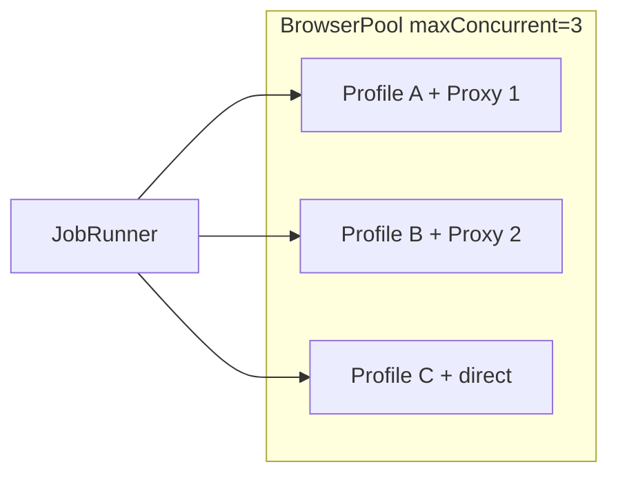

# 03 — Browser Engine & Multi-Browser

## Mục tiêu

Quản lý **nhiều browser profile** độc lập, mỗi profile có session/partition riêng, proxy riêng, dùng làm cloak browser để giải CAPTCHA/Turnstile hoặc automation nhẹ trên trang đích.

## BrowserProfile

```typescript
interface BrowserProfile {
  id: string;                    // uuid hoặc user-defined name
  label: string;                 // hiển thị UI: "Browser 1", "US Proxy"
  partition: string;             // `persist:profile-{id}`
  proxyId?: string;              // link tới ProxyConfig trong ProxyManager
  userAgent?: string;            // optional override
  visible: boolean;              // mặc định hidden (cloak mode)
  createdAt: string;
}
```

Lưu danh sách profile trong `electron-store` key `browserProfiles`.

## BrowserPool (`browser/browser-pool.ts`)

```typescript
class BrowserPool {
  constructor(options: {
    maxConcurrent: number;       // default 3
    defaultTimeoutMs: number;    // 60000
  });

  /** Tạo hoặc reuse BrowserWindow cho profile */
  acquire(profileId: string): Promise<BrowserSession>;

  /** Trả session về pool (giữ window hoặc destroy tùy config) */
  release(session: BrowserSession, destroy?: boolean): void;

  /** Tạo profile mới */
  createProfile(config: Partial<BrowserProfile>): BrowserProfile;

  /** Xóa profile + session liên quan */
  deleteProfile(profileId: string): void;

  listProfiles(): BrowserProfile[];
}
```

### Pool behavior

| Chế độ | Mô tả |
|--------|-------|
| `reuse` (default) | Giữ `BrowserWindow` ẩn, clear cookies khi `release` nếu `clearOnRelease: true` |
| `destroy` | Đóng window sau mỗi job — fingerprint sạch hơn, chậm hơn |

### Acquire flow

1. Lookup `BrowserProfile` → lấy `partition`, `proxyId`
2. `ProxyManager.applyToSession(session, proxy)` trước khi navigate
3. Tạo `BrowserWindow` nếu chưa có cho partition đó:
   - `show: false`, `width: 1024`, `height: 768`
   - `webPreferences.partition`, `contextIsolation: true`
4. Wrap thành `BrowserSession` implement contract

## CloakSession (`browser/cloak-session.ts`)

Helper dùng chung cho mọi site cần lấy token từ trang web (Turnstile, reCAPTCHA, v.v.).

```typescript
class CloakSession {
  /** Poll token từ Turnstile hidden input */
  static async waitForTurnstileToken(
    browser: BrowserSession,
    options?: { timeoutMs?: number; showOnTimeout?: boolean }
  ): Promise<string>;

  /** Generic: đợi điều kiện JS */
  static async waitForCondition(
    browser: BrowserSession,
    predicateScript: string,
    timeoutMs: number
  ): Promise<unknown>;
}
```

### Turnstile extraction (dùng chung)

```typescript
// Shared script — site provider gọi CloakSession.waitForTurnstileToken
// sau khi navigate tới sign-up URL
const TURNSTILE_SCRIPT = `
  new Promise((resolve, reject) => {
    const deadline = Date.now() + TIMEOUT;
    const tick = () => {
      const input = document.querySelector('[name="cf-turnstile-response"]');
      if (input?.value) return resolve(input.value);
      if (Date.now() > deadline) return reject(new Error('turnstile_timeout'));
      setTimeout(tick, 500);
    };
    tick();
  })
`;
```

Site provider (tokenlb) gọi:

```typescript
await ctx.browser.navigate(`${baseUrl}/sign-up`);
const token = await CloakSession.waitForTurnstileToken(ctx.browser, { showOnTimeout: true });
```

## Multi-browser trong UI

### Quản lý profiles

- Tab **Browsers**: danh sách profile, thêm/xóa, gán proxy, test "Open cloak window"
- Mỗi profile: label, proxy dropdown, nút Show/Hide window

### Gán browser khi đăng ký

| Mode | Hành vi |
|------|---------|
| `auto` | Pool round-robin qua profiles available |
| `fixed` | User chọn 1 profile cố định |
| `rotate` | Mỗi job trong batch dùng profile kế tiếp |

```typescript
interface JobBrowserOptions {
  mode: 'auto' | 'fixed' | 'rotate';
  profileId?: string;       // khi mode = fixed
  profileIds?: string[];    // khi mode = rotate
  clearCookiesOnRelease?: boolean;
}
```

## Parallel registration

```
maxConcurrent = min(batchSize, pool.maxConcurrent, availableProfiles)
```

Mỗi concurrent job **phải** dùng profile/browser khác nhau để tránh cookie/Turnstile conflict.



## Mở rộng sau

- Fingerprint hints (viewport, timezone) per profile — config JSON
- Import/export browser profiles
- Headless Chromium qua `puppeteer-core` + `electron` — chỉ khi cần scale lớn; MVP dùng `BrowserWindow` native
