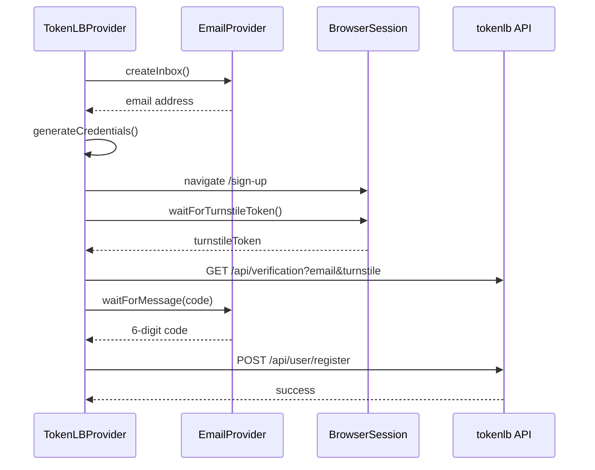

# 06 — Site Providers (tokenlb MVP)

## Abstraction

Mỗi website = 1 `SiteProvider` plugin. Core không biết chi tiết Turnstile, API path, hay form field của từng site.

## TokenLB Provider (MVP)

**ID:** `tokenlb`  
**URL:** `https://tokenlb.net`  
**Platform:** [New API](https://doc.newapi.pro/en/api/fei-user/)

### Site status (từ `/api/status`)

```json
{
  "email_verification": true,
  "turnstile_check": true,
  "turnstile_site_key": "0x4AAAAAADSUTFEqxmc6L9-k"
}
```

### Config schema (site-specific)

```typescript
getConfigSchema(): ConfigField[] => [
  { key: 'baseUrl', label: 'Base URL', type: 'text', default: 'https://tokenlb.net' },
  { key: 'usernamePrefix', label: 'Username prefix', type: 'text', default: 'user' },
  { key: 'affCode', label: 'Referral code', type: 'text', required: false },
  { key: 'interStepDelayMs', label: 'Delay between steps (ms)', type: 'number', default: 1000 },
]
```

### Registration flow



### API details

**1. Send verification email**

```
GET {baseUrl}/api/verification?email={email}&turnstile={token}
```

**2. Register**

```
POST {baseUrl}/api/user/register
Content-Type: application/json

{
  "username": "user_abc12345",
  "password": "random16chars",
  "email": "johndoe+kx7mq@gmail.com",
  "verification_code": "123456",
  "aff_code": "OPTIONAL"
}
```

### File structure

```
src/main/site-providers/tokenlb/
├── index.ts              # TokenLBProvider implements SiteProvider
├── api-client.ts         # verification + register HTTP
├── credentials.ts        # generateUsername, generatePassword
└── constants.ts          # default URLs, code regex
```

### `register()` pseudocode

```typescript
async register(ctx: JobContext, options: RegisterOptions): Promise<RegisterResult> {
  const emailProvider = registry.getEmail(ctx.emailProviderId);
  const baseUrl = options.siteConfig.baseUrl ?? 'https://tokenlb.net';

  const inbox = await emailProvider.createInbox(ctx);
  const username = generateUsername(options.siteConfig.usernamePrefix);
  const password = generatePassword(16);

  ctx.log('info', `Email: ${inbox.address}`);

  await ctx.browser.navigate(`${baseUrl}/sign-up`);
  const turnstile = await CloakSession.waitForTurnstileToken(ctx.browser);

  await api.sendVerification(baseUrl, inbox.address, turnstile, ctx.proxy);

  const msg = await emailProvider.waitForMessage(inbox, {
    subjectIncludes: 'verification',  // flexible match
  }, 120_000);

  const code = emailProvider.extractCode(msg);
  if (!code) return { success: false, error: 'verification_code_not_found' };

  await api.register(baseUrl, { username, password, email: inbox.address, verification_code: code, aff_code }, ctx.proxy);

  return {
    success: true,
    credentials: { username, password, email: inbox.address },
  };
}
```

### Saved record shape

```json
{
  "id": "uuid",
  "siteId": "tokenlb",
  "siteName": "TokenLB",
  "username": "user_abc12345",
  "password": "random16chars",
  "email": "johndoe+kx7mq@gmail.com",
  "registeredAt": "2026-06-08T10:30:00.000Z",
  "status": "success",
  "browserProfileId": "profile-1",
  "proxyId": "proxy-2",
  "error": null
}
```

## Thêm site mới (template)

```
src/main/site-providers/{site-id}/
├── index.ts
├── api-client.ts      # optional
├── flow.ts            # optional — nếu flow phức tạp
└── README.md          # document site-specific quirks
```

### Ví dụ site tương lai

| Site ID | Đặc thù có thể cần |
|---------|-------------------|
| `another-newapi` | Reuse base class `NewApiSiteProvider` — chỉ đổi `baseUrl` |
| `custom-saas` | Form fill qua browser, không có public API |
| `oauth-site` | OAuth redirect trong cloak browser |

### Shared base class (optional, phase 2)

Nếu nhiều site dùng New API:

```typescript
abstract class NewApiSiteProvider implements SiteProvider {
  abstract readonly id: string;
  abstract readonly baseUrl: string;
  // shared register() logic — tokenlb extends hoặc config-only instance
}
```

## UI — Site selection

- Dropdown **Target Site** trên màn Register
- Form dynamic fields từ `site.getConfigSchema()`
- Site chỉ hiện trong list sau khi `registry.registerSite()` — không hardcode dropdown
